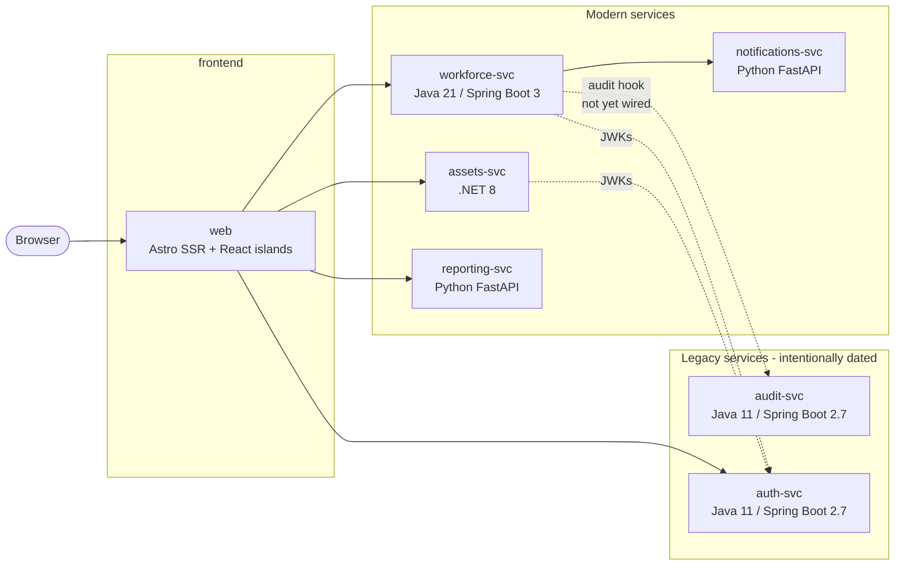

# AssetTrack (Contoso Industries)

AssetTrack is Contoso Industries' internal application for tracking hardware assets (laptops, monitors, phones, badges, docking stations) and the employees they're assigned to. It is intentionally built as a **polyglot microservices** application so that course learners can practice agentic, Copilot-driven development across a realistic multi-language stack — including a couple of older Java services that still need modernization.

## Architecture at a glance



All services talk over **REST/JSON**. Each service owns its own SQLite database.

| Service              | Stack                                  | Port  | Owns                                |
|----------------------|----------------------------------------|-------|-------------------------------------|
| `web`                | Astro (SSR) + React islands + Bootstrap 5 | 4321  | UI, BFF composition                 |
| `assets-svc`         | .NET 8 (ASP.NET Core minimal APIs)     | 5001  | Asset CRUD + search                 |
| `workforce-svc`      | Java 21 / Spring Boot 3                | 5002  | Employees + Assignments             |
| `reporting-svc`      | Python 3.12 / FastAPI                  | 5003  | Reports, CSV bulk import            |
| `notifications-svc`  | Python 3.12 / FastAPI                  | 5004  | Webhook receiver, email/Slack stub  |
| `audit-svc`          | Java 11 / Spring Boot 2.7 *(legacy)*   | 5005  | Audit event log                     |
| `auth-svc`           | Java 11 / Spring Boot 2.7 *(legacy)*   | 5006  | JWT issuer, user lookup             |

## Quick start (Codespaces or local devcontainer)

1. Open the repository in GitHub Codespaces, or in VS Code with the Dev Containers extension.
2. Wait for the devcontainer to finish provisioning. It installs:
   - Node 22, .NET 8, Python 3.12, Maven, and **two Java JDKs side-by-side** (Java 21 for modern services, Java 11 for the two legacy services).
   - `concurrently` and editable Python installs for the FastAPI services (via `postCreateCommand`).
3. From the workspace root:

   ```bash
   npm run dev
   ```

   This starts all seven services as plain processes (no Docker required). A startup banner prints the URL. Run `npm run dev:verbose` if you need full log output instead of WARN-only.

4. Open http://localhost:4321 — that's the UI. Backend services listen on 5001–5006 if you want to hit them directly with `curl`.

## Quick start (local without a devcontainer)

You need Node 22, .NET 8, Python 3.12, Maven, **and both Java 21 and Java 11** on your machine. Then:

```bash
npm install
npm run install:all
npm run dev
```

## Running with Docker (optional)

A `docker-compose.yml` is still provided as an alternative to the dockerless workflow:

```bash
docker compose up --build
```

Open http://localhost:4321.

## Running a single service for development

Each service folder has its own `README.md` with native (non-Docker) run instructions and per-service scripts. See:

- [`services/web/README.md`](services/web/README.md)
- [`services/assets-svc/README.md`](services/assets-svc/README.md)
- [`services/workforce-svc/README.md`](services/workforce-svc/README.md)
- [`services/reporting-svc/README.md`](services/reporting-svc/README.md)
- [`services/notifications-svc/README.md`](services/notifications-svc/README.md)
- [`services/audit-svc/README.md`](services/audit-svc/README.md)
- [`services/auth-svc/README.md`](services/auth-svc/README.md)

## Auth

`auth-svc` issues RS256 JWTs from `POST /token`. Other services validate tokens via the JWKs document at `http://auth-svc:8080/.well-known/jwks`.

For course exercises that aren't about auth, the frontend runs with `DEV_TOKEN_MODE=true`, which uses a pre-issued long-lived token so learners aren't blocked by login flows. To exercise the real flow, set it to `false`.

## What's intentionally broken or missing

This is a teaching codebase. Several services have deliberate gaps that drive the course exercises (see [`exercises.md`](exercises.md)). Here's a detailed inventory:

### Security gaps

- **auth-svc + audit-svc**: Both use raw JDBC with string concatenation (Exercise #3). `UserRepository.findByUsername()` and `AuditRepository.search()` are SQL injection vulnerabilities — `' OR 1=1 --` will bypass filters.
- **assets-svc**: Does **not** validate JWTs issued by `auth-svc` (Exercise #14). The auth-svc exposes its public keys at `GET /.well-known/jwks`, but assets-svc accepts all requests unauthenticated.
- **assets-svc**: `POST /assets` accepts unvalidated input with no DTO validators (Exercise #7). Fields lack nullability constraints.

### Modernization debt

- **auth-svc + audit-svc**: Run Spring Boot 2.7 (EOL Dec 2023) + Java 11 (EOL Sep 2026). Both intentionally outdated to teach framework upgrades (Exercises #9 + #12).
- **auth-svc**: Uses JJWT 0.11.5, an older major version where the API changed significantly in newer releases.
- **reporting-svc**: `app/legacy/format_helpers.py` uses deprecated Python idioms — `%` formatting instead of f-strings, `os.path.join` instead of `pathlib.Path`, no type hints, violates PEP 257 (Exercise #4).

### Missing features & resilience

- **assets-svc**: `GET /assets/by-tag/{tag}` endpoint is declared but not wired (Exercise #10).
- **assets-svc**: `Tests/` directory has only 1 smoke test; lacks CRUD, search, and stats endpoint coverage (Exercise #2).
- **reporting-svc**: `POST /imports/assets` crashes on the first malformed CSV row with no per-row error handling (Exercise #6). Should return `{ "imported": N, "skipped": M, "errors": [...] }`.
- **reporting-svc**: `tests/` directory is completely empty (Exercise #11).
- **notifications-svc**: Email and Slack integrations are stubs (only `print()` statements; no actual dispatch).
- **workforce-svc**: Calls to `audit-svc` and `notifications-svc` via `RestClient` lack timeout, retry, or circuit-breaker logic. If either service is down, assignment creation fails (no error boundaries).
- **workforce-svc**: The audit hook in `AssignmentService` is commented out — partially wired but disabled (Exercise #13). Uncomment + wire it to call `POST /events` on audit-svc for each assignment change.

### UI bugs

- **web**: `StatusBadge.astro` maps statuses to incorrect colors — `retired` shows green (should be gray) and `lost` shows blue (should be red) (Exercise #8).

See [`exercises.md`](exercises.md) for the full exercise list and how to complete each gap.

## Course exercises

See [`exercises.md`](exercises.md). Each exercise is **atomic** — completing one is not a prerequisite for another. Exercises cover all five stacks (Astro, .NET, modern Java, Python, legacy Java) so learners can pick what's most useful to them.
